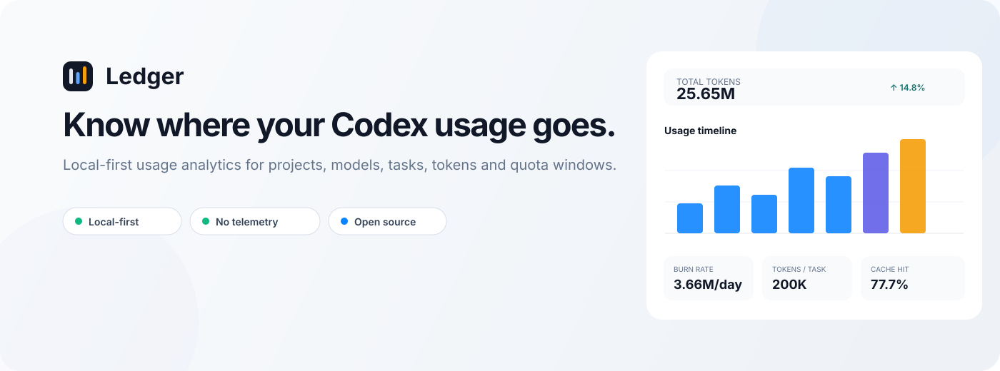
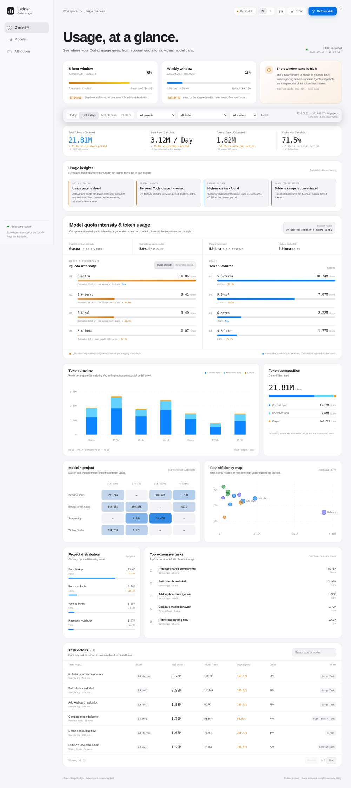
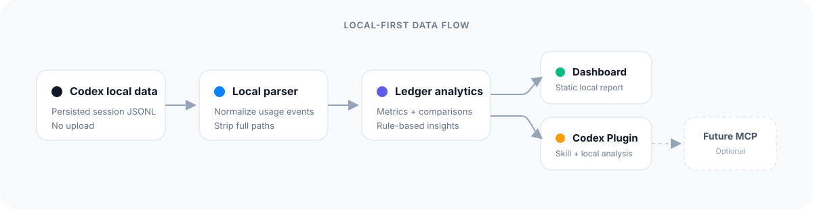

<p align="center">
  
</p>

<p align="center">
  <a href="./README.md"><strong>English</strong></a> · <strong>简体中文</strong>
</p>

<p align="center">
  <a href="./LICENSE"></a>
  
  
  
  
  
</p>

# 看清你的 Codex 用量到底去哪了。

**Ledger** 是一个免费、开源、Local-first（本地优先）的 Codex 用量分析工具。它把 Codex 已经保存在你电脑上的本地 Usage 数据，整理成清楚的 **Token、项目、模型、任务、趋势、缓存效率，以及可观测额度窗口** Dashboard。

不需要 Ledger 账号，不需要云端服务，不发送 Telemetry。

> **推荐方式：**把 **Ledger for Codex** 安装成 Codex Plugin，之后直接让 Codex 打开或分析你的本地用量。也可以完全不装 Plugin，Clone 后用一条 Python 命令运行。

---

## 30 秒看懂 Ledger

| 你想知道 | Ledger 告诉你 |
|---|---|
| 最近到底用了多少？ | 可观测 Token 总量 + 与上一周期对比 |
| 当前消耗是不是太快？ | 消耗速率（Burn Rate）+ 可观测额度窗口节奏 |
| 用量都花在哪？ | 项目、模型、模型 × 项目分布 |
| 哪些任务最费？ | 高消耗任务、单轮 Token、缓存命中、消耗特征 |
| 最近有什么变化？ | 环比变化 + 基于透明规则生成的 Usage Insights |
| 数据会上传吗？ | 默认不会，解析和报告都在本机完成 |

<p align="center">
  
</p>

<sub>截图使用合成演示数据，仓库不包含任何人的真实 Codex Usage 历史。</sub>

---

## 为什么需要 Ledger？

Codex 可以完成很多工作，但原始 Usage 轨迹并不容易一眼看懂。

| 没有 Ledger | 使用 Ledger |
|---|---|
| “我的用量到底去哪了？” | 看项目 / 模型归因 |
| “为什么这个任务这么大？” | 看任务 Token 构成和消耗特征 |
| “今天是不是异常？” | 看消耗速率、异常点和上一周期对比 |
| “缓存有没有起作用？” | 看缓存命中率和缓存 / 非缓存输入 |
| “额度还剩多少？” | Codex 本地有可观测快照时展示 5 小时 / 每周窗口 |

Ledger **不会**拿 Token 总量反推出一个假的会员额度百分比。如果 Codex 本地没有持久化 rate-limit 快照，额度卡片会明确显示“不可用”。

---

## Ledger 能看什么

<table>
<tr>
<td width="50%" valign="top">

### 看懂整体用量

- 可观测 Token 总量
- 消耗速率（Burn Rate）
- 单任务 Token
- 缓存命中率
- 与上一周期比较

</td>
<td width="50%" valign="top">

### 看用量去了哪里

- 项目分布
- 模型分布
- 模型 × 项目矩阵
- Token 时间线
- Token 构成

</td>
</tr>
<tr>
<td width="50%" valign="top">

### 找出高消耗任务

- Top Expensive Tasks
- 任务效率分布图
- Tokens / Turn
- Task Detail
- 透明规则生成的消耗特征

</td>
<td width="50%" valign="top">

### 发现变化

- Usage Insights
- 周期环比变化
- 异常任务
- 有快照时展示额度节奏

</td>
</tr>
</table>

---

## 安装成 Codex Plugin · 推荐

Ledger 已经打包成可移植 Agent Plugin，并内置 `ledger-analysis` Skill。v0.1.3 **不需要 MCP Server，也不需要任何外部账号**。

### 1. 添加 GitHub Marketplace

```bash
codex plugin marketplace add ctdaniel/codex-ledger
```

### 2. 安装 **Ledger for Codex**

在 **ChatGPT 桌面端**或 **Codex CLI** 中打开 Plugin Directory，选择 **Ledger for Codex** Marketplace，然后安装 **Ledger for Codex**。在 Codex CLI 中输入 `/plugins` 即可打开 Plugin Browser。

如果安装后 Skill 没有马上出现，新开一个 Session 或重启客户端即可。Codex IDE Extension 当前不提供 Plugin Browser，因此安装时请使用 ChatGPT 桌面端或 Codex CLI。

### 3. 直接问 Codex

```text
打开我的 Codex Usage Dashboard。
```

```text
分析我最近 7 天的 Codex 使用情况。
```

```text
找出最近最费额度的 5 个 Codex 任务。
```

内置 Skill 会调用本地 Parser、生成私有静态报告；需要在聊天里分析时，只读取**已经脱敏和标准化后的 Payload**，不会把原始 rollout 日志整段倒进对话。

> 不同客户端的 Plugin 安装入口可能略有差异。Marketplace 命令和包格式遵循当前 [OpenAI Plugin 官方文档](https://developers.openai.com/plugins/build/plugins)。即使某个客户端暂时不提供 Plugin，下面的本地运行方式仍然可以独立使用。

---

## 本地直接运行

Ledger **没有 npm 依赖，也不需要 Build**。Python 3 用来解析 Codex 本地 Session Telemetry，并在 `127.0.0.1` 启动本地 Dashboard。使用 `--open` 时，页面里的 **刷新数据** 会立即重新扫描 `~/.codex`；刷新本身不会调用模型，也不会消耗 Codex 模型额度。

```bash
git clone https://github.com/ctdaniel/codex-ledger.git
cd codex-ledger
python3 scripts/ledger.py --open
```

`--open` 会保持一个仅监听 `127.0.0.1` 的本地服务。保持终端进程运行时，页面中的 **刷新数据** 会重新解析最新本地 Codex 记录；按 `Ctrl+C` 停止服务。直接用 `file://` 打开生成的 `index.html` 只是静态快照，浏览器无法重新扫描本机文件。

使用 `--open` 时，Ledger 会：

1. 读取 `$CODEX_HOME`，没有设置时读取 `~/.codex`；
2. 扫描最近 90 天已持久化的 Session；
3. 只保留标准化的 Usage Metadata；
4. 把报告写到 `~/.codex/ledger/latest/`；
5. 在 `127.0.0.1` 启动仅本机可访问的 HTTP Server；
6. 自动在默认浏览器打开 Dashboard；
7. 每次点击 **刷新数据** 时重新扫描最新的 Codex 本地记录。

使用实时刷新时请保持终端进程运行；按 `Ctrl+C` 停止。如果直接通过 `file://` 打开生成的 `index.html`，它只是静态快照，受浏览器沙箱限制，无法重新读取本机 Codex 文件。

常用参数：

```bash
# 解析所有能够发现的历史 Session
python3 scripts/ledger.py --days 0 --open

# 输出到其他本地目录
python3 scripts/ledger.py --output ./ledger-report --open

# 只启动本地服务，不自动打开浏览器
python3 scripts/ledger.py --serve

# 不生成页面，只输出脱敏后的标准化 Payload
python3 scripts/ledger.py --json
```

只想先看看界面？直接打开仓库里的 `index.html`，它使用的是确定性的合成演示数据，不读取你的 Codex 数据。

---

## 怎么用 Ledger

### Dashboard

可以切换 **今天 / 近 7 天 / 近 30 天 / 自定义**，并按项目、任务、模型筛选。所有 KPI、图表、Insights、排名和任务详情都会基于同一份筛选后的数据重新计算。

Ledger 会区分三种数据：

- **Observed**：直接存在于 Codex 本地持久化 Telemetry 中的数据。
- **Calculated**：根据 Observed 数据在本机计算得到。
- **Estimated**：预测或费率权重估算；绝不会冒充官方账单或官方额度。

### 在 Codex 中直接问

安装 Plugin 后可以试试：

```text
最近 30 天哪个项目消耗最多？
```

```text
哪些任务的单轮 Token 明显偏高？
```

```text
我的缓存命中率相比上一周期有没有改善？
```

```text
现在有没有可观测的额度快照？
```

---

## 它是怎么工作的

<p align="center">
  
</p>

当前 Parser 以 **best-effort** 方式读取 Codex 已持久化到本机的 rollout JSONL。Token 统计使用每次请求的 `last_token_usage`；它明确**不会**把累计的 `total_token_usage` 快照相加，否则会把相同用量重复计算很多次。

项目归因只保留 `cwd` 的最后一级目录名，不保存完整本机路径。为了让你能识别具体任务，本地报告也可能保留 Codex 已持久化的 Session / Thread 标题。

---

## Privacy

### 你的 Usage 数据应该属于你自己。

Ledger 从设计上就是 Local-first。

- ✅ 不需要 Ledger 账号
- ✅ 不需要云端 Backend
- ✅ 不发送 Telemetry
- ✅ 不上传 Prompt 正文
- ✅ 不上传 Assistant / Tool 输出
- ✅ 不上传代码和 Repository 内容
- ✅ 不收集 API Key 或 Auth 文件
- ✅ 生成报告时会去掉完整本机路径

为了完成有用的项目 / 任务归因，生成在本地的 Dashboard **可能包含 Session 标题和项目文件夹 basename**。这些信息仍然只保存在你的电脑上，除非你主动分享报告或截图。

仓库内的 Demo Data 全部是合成数据；所有本地 Usage / Snapshot 文件模式都已经加入 `.gitignore`。

---

## 数据覆盖与限制

Ledger v0.1.3 不会把“本地 Telemetry”假装成正式 Billing API。

- Codex 本地 Session 格式未来可能变化；Parser 是 best-effort，并通过 Fixture / Unit Test 做回归验证。
- 没有持久化 `last_token_usage` 的 Session 无法贡献 Token 记录。
- 只有观察到本地 `rate_limits` Snapshot 时才展示额度卡片。
- 不会根据 Token 总量虚构 5 小时 / 每周额度百分比。
- 只有存在可用 Duration Telemetry 时才展示生成速度。
- 只有当前模型存在内置费率映射时才展示模型费率权重估算，否则显示不可用。

如果 Codex 改了本地 Telemetry Schema，欢迎提 Issue，但请只提供**脱敏后的 Schema Sample**，不要上传包含私人内容的原始 Session。

---

## Plugin 包结构

Ledger 的 Repository Root 本身就是可移植 Agent Plugin Package：

```text
codex-ledger/
├── plugin.json                       # Agent Plugins 1.0 可移植 Manifest
├── .codex-plugin/plugin.json         # Codex 兼容 Fallback
├── skills/
│   └── ledger-analysis/
│       ├── SKILL.md
│       └── references/
├── scripts/
│   └── ledger.py                     # 本地、零依赖 Parser
├── .agents/plugins/marketplace.json  # GitHub Marketplace Catalog
├── index.html
├── app.css
├── app.js
└── assets/
```

v0.1.3 有意采用 **Skill-first Plugin**。仅仅为了读取本机已有文件并生成 Dashboard，并不需要额外启动一个 MCP Server。

---

## 开发与验证

```bash
python3 -m unittest discover -s tests -v
node --check app.js
python3 -m json.tool plugin.json >/dev/null
python3 -m json.tool .agents/plugins/marketplace.json >/dev/null
```

参与贡献请看 [CONTRIBUTING.md](./CONTRIBUTING.md)，当前界面设计说明在 [docs/DESIGN.md](./docs/DESIGN.md)。

---

## Roadmap

### v0.1.3 已有

- [x] Codex 本地 Token Parser
- [x] 项目 / 模型 / 任务归因
- [x] 消耗速率、缓存和环比分析
- [x] 高消耗任务 + Task Driver
- [x] 本地存在时读取可观测额度快照
- [x] 中英文 Dashboard
- [x] Codex Plugin + Ledger Analysis Skill
- [x] GitHub Marketplace Packaging
- [x] Dashboard 实时本地刷新（`--open` / `--serve`）

### 后续计划

- [ ] 更深入的 Session / Context Health
- [ ] 更完整的 Parser Coverage Diagnostics
- [ ] 可导出的隐私安全报告
- [ ] 如果确实能提升体验，再增加可选 Local MCP
- [ ] 支持更多 AI Coding Agent Adapter
- [ ] 更好的异常检测

不承诺具体日期，欢迎一起贡献。

---

## 为什么开源？

**看清自己的 AI Coding 使用情况，不应该是一个付费功能。**

Ledger 会保持免费、开源。你可以直接检查它到底读取了什么、指标怎么算、什么信息始终留在本地；未来 Codex 的本地格式发生变化，也可以由社区一起维护 Adapter，而不是依赖黑盒服务。

---

## License

MIT © 2026 Daniel Chen and contributors.

如果 Ledger 真的让你的 Codex 用量更容易看懂，欢迎点一个 ⭐，让更多人看到。